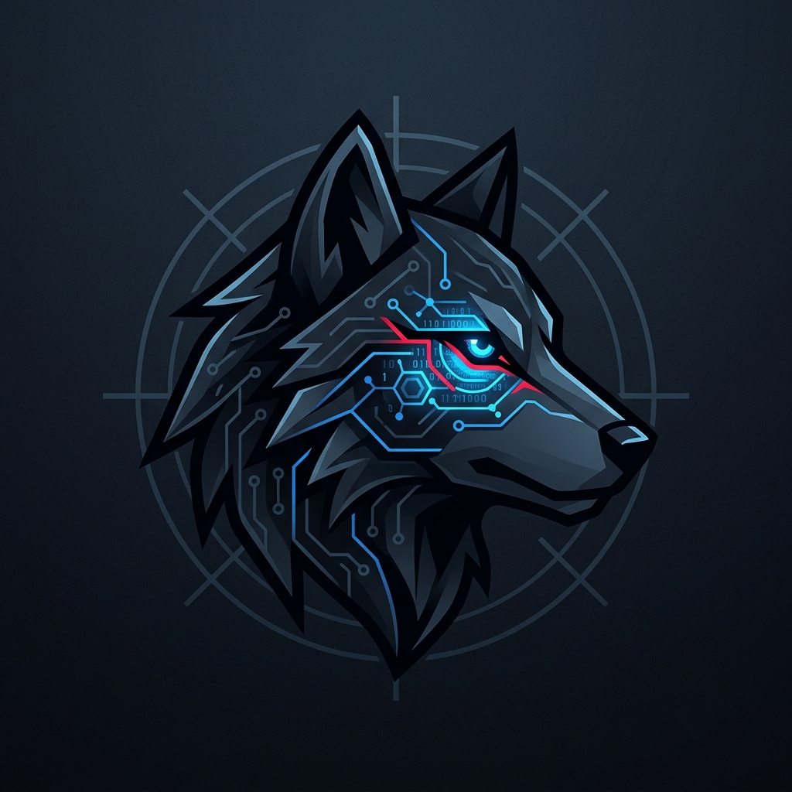
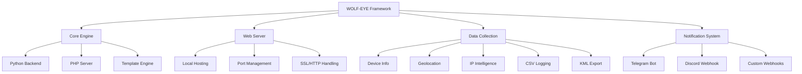
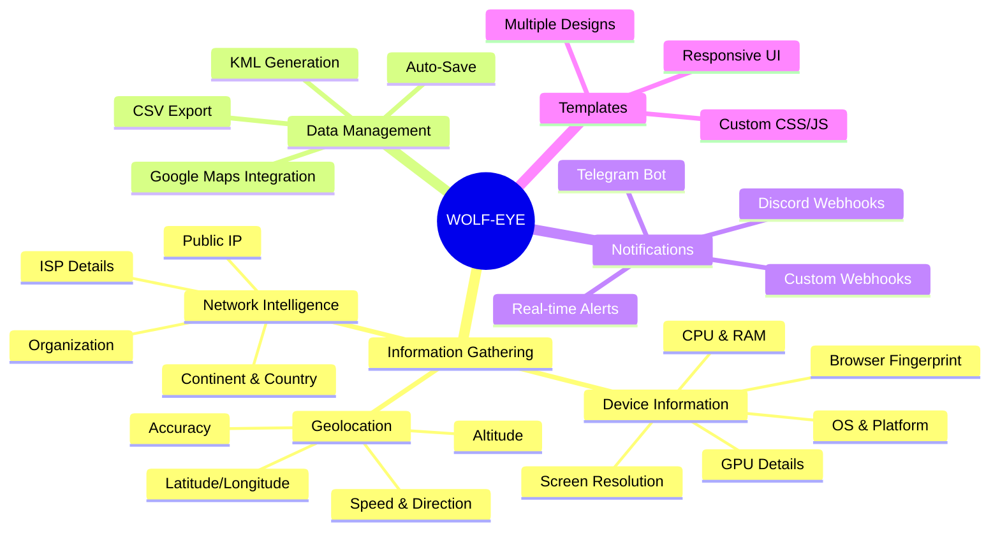
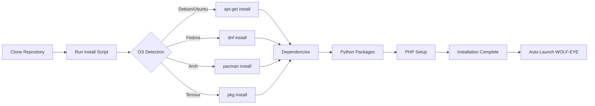
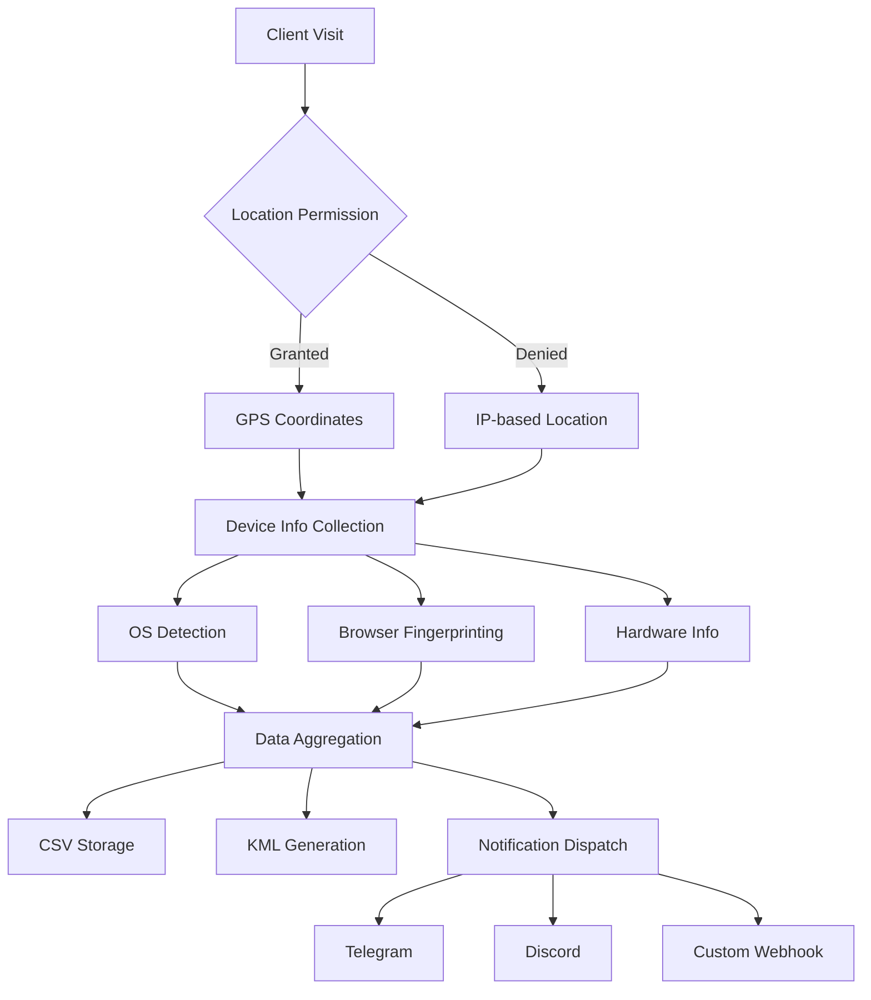
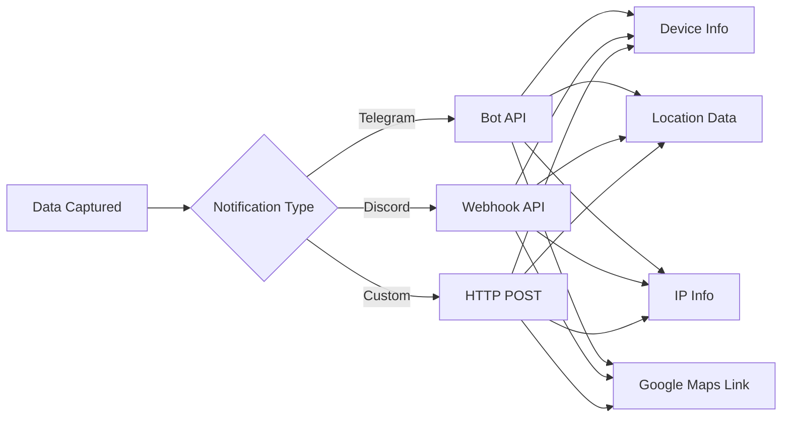

<div align="center">
  <a href="https://github.com/wolf-intelligence-pk/WOLF-EYE">
    
  </a>

  # 🐺 WOLF-EYE v1.0 - Advanced Reconnaissance Framework
  
  
  
  
  
  
  
  *Advanced Browser-Based Information Gathering & Geolocation Framework*
</div>

---

## 📊 Architecture Overview




## 🎯 Features Matrix




## 🚀 Installation Process



## 💻 Quick Start

### Clone the repository
```
git clone https://github.com/wolf-intelligence-pk/WOLF-EYE.git
cd WOLF-EYE
```
### Make install script executable
```
chmod +x install.sh
```
### Run installation (auto-detects OS and launches WOLF-EYE)

```
./install.sh
```


## 🎮 Usage Examples


### Basic usage
```
python3 wolf-eye.py
```
### Specify KML output file
```
python3 wolf-eye.py -k output_filename
```
### Use specific template
```
python3 wolf-eye.py -t 0
```

### Set custom port
```
python3 wolf-eye.py -p 8080
```

### Enable Telegram notifications
```
python3 wolf-eye.py -tg "token:chatId"
```

### Enable webhook notifications
```
python3 wolf-eye.py -wh "https://webhook.url"
```

### Check for updates
```
python3 wolf-eye.py -u
```

### Display version
```
python3 wolf-eye.py -v
```

### Disable HTTPS redirection (testing)
```
python3 wolf-eye.py -d true
```

## 📋 Command Line Arguments

| Argument | Flag | Description | Example |
|----------|------|-------------|---------|
| KML Output | `-k` `--kml` | KML filename for Google Earth export | `-k target_location` |
| Port | `-p` `--port` | Web server port (Default: 8080) | `-p 4444` |
| Template | `-t` `--template` | Template number to load | `-t 0` |
| Telegram | `-tg` `--telegram` | Telegram bot token:chatId | `-tg "123456:ABC-DEF"` |
| Webhook | `-wh` `--webhook` | Webhook URL for notifications | `-wh "https://discord.com/api/webhooks/..."` |
| Update | `-u` `--update` | Check for latest version | `-u` |
| Version | `-v` `--version` | Print current version | `-v` |
| Debug HTTP | `-d` `--debugHTTP` | Disable HTTPS redirection | `-d true` |

### Environment Variables

| Variable | Description | Example |
|----------|-------------|---------|
| `PORT` | Web server port | `export PORT=4444` |
| `TELEGRAM` | Telegram bot credentials | `export TELEGRAM="token:chatId"` |
| `WEBHOOK` | Webhook URL | `export WEBHOOK="https://..."` |
| `DEBUG_HTTP` | Debug mode flag | `export DEBUG_HTTP=1` |
| `TEMPLATE` | Template number | `export TEMPLATE=0` |

## 🔧 Data Collection Pipeline




## 📊 Information Collected

### Device Information
1. Operating System & Platform
2. CPU Cores & Architecture
3. RAM Size
4. GPU Vendor & Renderer
5. Screen Resolution
6. Browser Type & Version

### Network Intelligence
1. Public IP Address

2. ISP (Internet Service Provider)

3. Organization

4. Continent & Country

5. Region & City

### Geolocation Data

1. Latitude & Longitude

2. Accuracy (meters)

3. Altitude

4. Speed (if moving)

5. Direction/Heading

## 🔔 Notification Systems



## ⚙️ System Requirements

1. Python 3.x

2. PHP 7.0+

3. OS: Linux, Termux, macOS

4. RAM: Minimum 512MB

5. Storage: 100MB free space

6. Network: Internet connection

<div align="center">
🐺 WOLF INTELLIGENCE PK
"Knowledge is Power, Use it Wisely"

Made with ❤️ by ATHEX BLACK HAT

© 2026 WOLF-EYE Framework. All rights reserved.

</div> ```